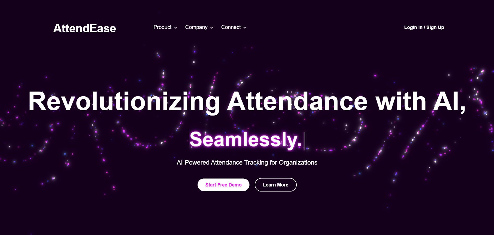

# AttendEase - AI-Based Attendance System

 
## Overview
AttendEase is an AI-powered attendance system that utilizes facial recognition and anti-spoofing techniques to track student and employee attendance. The system supports automatic attendance marking, real-time verification, and an admin dashboard for management.

## Features
- **AI-Based Facial Recognition**: Detects and verifies faces with anti-spoofing measures.
- **Automated Attendance Logging**: Tracks attendance based on duration and presence.
- **Multi-Factor Authentication**: Supports barcode scanning and biometric checks.
- **Admin Dashboard**: Manage users, subjects, and attendance records.
- **Web-Based Interface**: Accessible from any device.

---

## System Requirements
### Hardware:
- **IP Camera** (for real-time attendance tracking)
- **ESP32 Chip** (optional for IoT integrations)

### Software:
- **Python 3.10** (Recommended for stability)
- **PyCharm IDE** (or Visual Studio Code)
- **Node.js** (For running the web server)
- **MySQL Database** (For data storage)

---

## Installation Guide
### Step 1: Clone the Repository
```bash
 git clone 
 cd AttendEase
```

### Step 2: Set Up Python Environment
1. Open **PyCharm** and create a new project.
2. Set the Python interpreter to **Python 3.10**.
3. Install prerequisites:
   ```bash
   pip install -r requirements.txt
   ```
4. Ensure `pip`, `setuptools`, and `wheel` are installed:
   ```bash
   pip install pip==23.2.1 setuptools==68.2.0 wheel==0.41.2
   ```

### Step 3: Install Node.js Requirements
1. Check if Node.js is installed:
   ```bash
   node -v
   ```
   If not installed, download from [Node.js Official Website](https://nodejs.org/).

2. Install required packages:
   ```bash
   npm install express csv-parser mysql2 body-parser bcryptjs express-session multer dotenv fs nodemailer
   ```

### Step 4: Configure Database
1. Open `Config/databaseconfig.js`
2. Update the MySQL credentials:
   ```javascript
   module.exports = {
     host: 'localhost',
     user: 'root', // Change this to your MySQL username
     password: '', // Change this to your MySQL password
     database: 'AttendEaseDB'
   };
   ```

### Step 5: Start the Server
```bash
 node ./Server.js
```
This will:
- Create the database and necessary tables.
- Set up a default admin account (`admin@example.com / password`).
- Start the web interface at `http://localhost:3030`.

---

## Testing Face Recognition
### Manual Testing (Without Classroom Setup)
To test the face recognition system manually:
```bash
 python attendancelogfacemanual.py
```
- Uses a webcam for recognition.
- Runs anti-spoofing detection.
- Saves detected faces temporarily.

To verify anti-spoofing, try showing an image or video instead of a real face.

---

## File Structure
```
AttendEase/
├── Server.js            # Main server script
├── Config/
│   ├── databaseconfig.js # Database configuration
├── Models/              # AI and ML models
├── Public/              # Frontend assets
├── Scripts/             # Utility scripts
├── Logs/                # Attendance logs
├── README.md            # This file
```

---

## Documentation
For a detailed guide on using the web dashboard and additional configurations, refer to the project documentation.

---
# Project Contributions and Ownership

This project was developed collaboratively by multiple contributors.

- The core system, including AttendanceLogFace.py, Reconfigure.py, and IPModeMain.py, was entirely authored and maintained by Shah Siam.  
- Additional source files authored by other contributors contain their respective copyright notices and usage restrictions.  
- Shah Siam led the system design, integration, project management, testing, and iterative improvements throughout development.  
- This repository reflects Shah Siam’s consolidated and cleaned version of the project codebase.

Please respect individual file licenses and seek permission from the respective authors for reuse of their code.


---

# Vision & Problem Statement

Traditional attendance systems in universities are either inefficient or easily bypassed. QR codes are instantly shared in group chats, RFID and fingerprint systems cause delays or can be spoofed, and manual roll calls waste valuable lecture time without guaranteeing real participation. Existing facial recognition tools also fall short, being vulnerable to spoofing and unable to track how long students remain in class.

AttendEase solves these problems by combining facial recognition with anti-spoofing and automated time tracking. The system logs attendance seamlessly as students enter and exit, ensuring accuracy to the second while preventing fraudulent check-ins. This reduces administrative overhead, saves up to 10 minutes per lecture, and provides real-time, reliable reports.

Our vision is to make attendance frictionless and secure, starting with universities but scalable to corporate offices and other environments requiring robust identity verification.

---

# My Role as Product Owner & Project Manager

While AttendEase was a collaborative project, I acted as the product owner and project manager, guiding both the technical and strategic direction. 

My contributions included:

- **Defining the vision and requirements**: Identified inefficiencies in existing attendance systems and translated them into clear, testable requirements for the team.

- **System design & integration leadership**: Designed the end-to-end architecture, authored core modules (AttendanceLogFace.py, Reconfigure.py, IPModeMain.py), and integrated contributions from teammates into a unified system.

- **Team & project management**: Coordinated task division, maintained timelines, and resolved design disputes to keep development aligned with the core vision.

- **Testing & quality assurance**: Led the testing strategy, combining functional, non-functional, and usability testing to validate accuracy, performance, and reliability.

- **Iterative improvement**: Identified bottlenecks (e.g., lag from logging delays, spoofing attempts, low-light failures) and drove fixes through threading, image enhancement, and automation features.

- **Documentation & stakeholder communication**: Produced requirement analysis, system design docs, test plans, and Figma prototypes, ensuring the product was both technically sound and clearly communicated.

This role required balancing _technical implementation_ with _product thinking_, ensuring AttendEase delivered not just working code but a reliable, scalable, and user-focused solution — ultimately earning a **High Distinction**.

---

Perfect — your answers show you were thinking like a **product owner/strategist** the whole way: balancing usability, cost, deployment, scalability, and real-world constraints. Here’s a **System Design & Decisions** section you can put into your README that reflects those trade-offs and shows your decision-making:

---

## System Design & Decisions

As Product Owner and Project Manager, I focused not only on technical implementation but also on **strategic design trade-offs** to ensure AttendEase could deliver real-world value under strict timelines. Key decisions included:

* **Facial Recognition Pipeline**: Haar cascades were tested early but failed to integrate reliably with the anti-spoofing module. I chose **MTCNN + InceptionResnetV1** for their balance of accuracy, robustness, and compatibility with our liveness model. This ensured strong recognition performance without sacrificing integration.

* **Accuracy vs. Latency**: While recognition thresholds (0.8 for duplicates, 0.9 for matching) reduced false positives, the larger challenge was **processing lag and logging delays**. I prioritized system responsiveness, redesigning the architecture with **multithreading and queuing per module** to support real-time recognition on IP/WiFi cameras.

* **Anti-Spoofing Design**: Hardware-based defenses like IR or 3D depth were rejected to keep AttendEase **easily deployable with existing university IP cameras**. A purely software-based RGB model was chosen as the optimal cost-effective and scalable approach.

* **Edge vs. Server Processing**: I opted for **local edge processing** to minimize latency, avoid single points of failure, and allow each classroom to apply unique attendance rules. Analytics and reporting were scoped for server-side deployment, deferred due to funding constraints.

* **Database Choice**: A **CSV-based storage** was used as an MVP decision under a 3-month timeline. While not scalable long-term, this enabled rapid prototyping and proof of accuracy, with a roadmap toward relational/NoSQL databases for multi-tenant SaaS deployment.

* **Automation for Usability**: Features like **auto camera discovery, credential reuse, and automatic threshold optimization** were designed to reduce human setup effort. This ensured lecturers and admins would not waste time typing RTSP URLs or manually calibrating thresholds.

* **Security & Roadmap**: Encryption at rest/in transit was acknowledged as a gap, consciously deferred to future development. This was positioned as a **roadmap item**, not a failure, ensuring stakeholders understood the MVP scope vs. long-term plan.

* **Scalability Vision**: AttendEase was scoped as a **single-campus MVP**, with the long-term vision as a **SaaS platform** where each institution runs its own instance on local servers. This provides flexibility, scalability, and tenant-level data isolation.

These design decisions reflect how I balanced **technical feasibility, user experience, and long-term strategy** under academic and financial constraints, ensuring AttendEase functioned not just as a demo but as a **deployable and extensible product**.

---
Excellent — your answers make it clear you ran testing like a **product QA lead**, not just a coder. You defined KPIs, tied them to requirements with a traceability matrix, tested across multiple conditions, and drove **iterative improvements** rather than treating testing as a checkbox.

Here’s how I’d write the **Testing & Validation** section for your README to highlight your **product ownership, project management, and strategist mindset**:

---

## Testing & Validation

Testing was approached not as a final step but as an **iterative validation cycle** to ensure AttendEase delivered consistent value across conditions. I led the creation of a **traceability matrix**, mapping every requirement to corresponding test cases, and structured testing across multiple dimensions:

* **Functional Testing**: Verified recognition, spoof detection, and logging accuracy against system requirements.
* **Performance Testing**: Measured recognition speed (<2s), logging precision (1s accuracy), and responsiveness across varying hardware.
* **Security Testing**: Validated spoof detection resilience through simulated attacks with photos, videos, and obstructions.
* **Compatibility Testing**: Ensured stable performance with multiple ONVIF-compatible IP cameras and different resolutions.
* **Usability & UX Testing**: Assessed ease of use for faculty/admin, focusing on automation features that reduced manual input.
* **Accessibility Testing**: Tested performance under low light, side angles, varying distances, and crowded entry conditions.
* **Error Handling**: Verified graceful recovery from lag, network drops, and camera failures.

### 🔍 Key Outcomes

* **99% recognition accuracy** and **spoof detection reliability** in controlled tests.
* **Recognition speed consistently <2 seconds**, logging accuracy to the nearest second.
* **10 minutes saved per class on average**, eliminating manual roll calls.
* Robust performance across low light, side-angle entry, and different camera setups.

### 🚀 Iterative Improvements Driven by Testing

* **Lag & delay** uncovered in logging → solved via **multithreading and queuing**.
* **Accuracy issues** with thresholds → optimized recognition/spoof parameters for balanced performance.
* **Low-light/angle challenges** → implemented image enhancement functions.
* **Manual input friction** (RTSP, thresholds) → added automation for camera setup and threshold synchronization.

Testing was not about proving the system “worked” once, but about **finding the design, thresholds, and frameworks that delivered consistently above-satisfactory results** across domains and constraints.

---
Perfect — your answers are sharp and very **strategist-oriented**: respecting institutional culture, balancing automation with control, and designing for adoption rather than enforcement. Here’s a polished **Business & Policy Layer** section for your README:

---

## 🏛 Business & Policy Layer

AttendEase was designed not only as a technical solution, but as a system that could fit seamlessly into the **cultural, administrative, and policy environments** of universities and institutions. As Product Owner, I prioritized adaptability and institutional trust.

* **Policy Flexibility**: We avoided enforcing a rigid definition of attendance. Instead, institutions define their own thresholds (time %, session duration, or other rules). This ensured AttendEase could integrate into existing practices across diverse cultures and governance styles.

* **Balance of Automation & Control**: While the system automates most processes, administrators and faculty retain full control through overrides and configurable policies. This balance made the system reliable yet adaptable to institutional rulebooks.

* **Role-Based Access**: Roles were streamlined to the three key stakeholders in attendance — **Admin, Faculty, and Student** — providing personalization without unnecessary complexity.

* **Dashboard & Analytics**: The admin dashboard was designed for **insights, not just compliance**. It provides per-class reporting today, with a roadmap for deeper analytics (per-student, per-course, trend analysis). This positions AttendEase as a tool for smarter decision-making, not just proof of presence.

* **Adoption & Trust**: Privacy and control concerns were addressed by giving each institution its own SaaS instance. **Biometric compliance and database management remain the responsibility of the institution**, not us, ensuring local governance and data sovereignty.

* **Value Proposition**: AttendEase delivers measurable efficiency — saving 10+ minutes per class, reducing fraud, and removing administrative burden — allowing faculty to focus on teaching. Positioned as both a **cost-saver** and a **quality improver**, it directly enhances institutional productivity.

* **Scalability of Policies**: Each institution runs its own copy of AttendEase and can tailor attendance policies down to faculty, course, or even classroom level. This makes the system both scalable and highly customizable.

By focusing on **institutional respect, adaptability, and long-term scalability**, I ensured AttendEase was not just a technical prototype but a **deployable solution aligned with real-world governance and adoption dynamics**.

---

